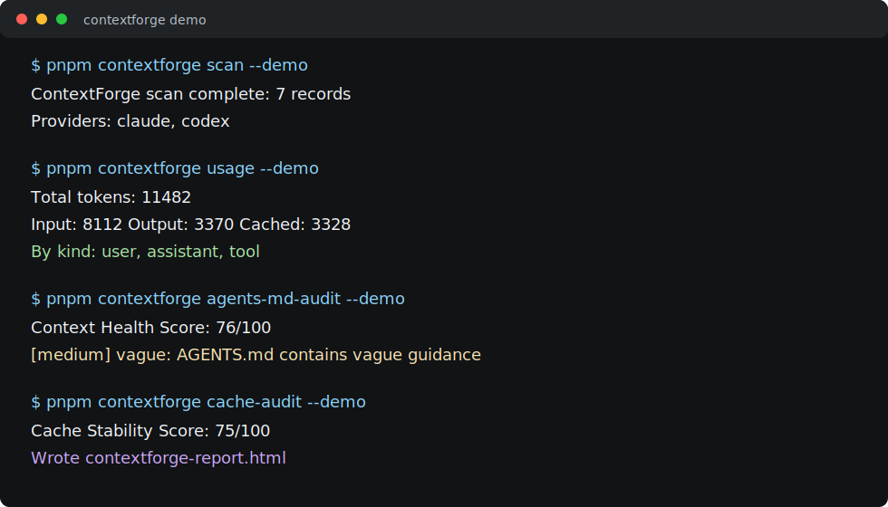
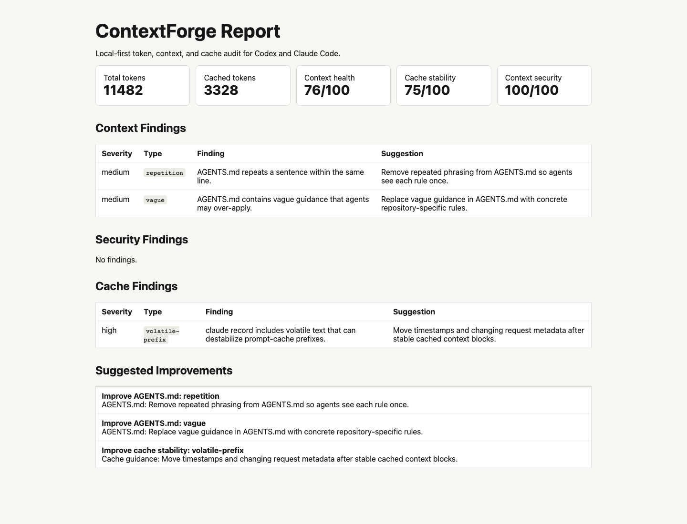

# ContextForge

**Self-learning token and context optimizer for Codex and Claude Code.**

[](https://github.com/grnbtqdbyx-create/contextforge/actions/workflows/ci.yml)
[](https://github.com/grnbtqdbyx-create/contextforge/actions/workflows/contextforge-audit.yml)
[](LICENSE)
[](docs/build-in-public.md)
[](CONTRIBUTING.md)
[](docs/npm-publish.md)

AI coding agents do not fail only because the model is weak. They fail because
repositories feed them noisy instructions, unstable cache prefixes, giant tool
outputs, and unsafe Markdown they treat as trusted context.

ContextForge is a local-first CI gate for that layer. It shows where agent
tokens go, reduces context bloat, audits prompt-cache stability, scans root and
nested repo instructions for prompt/context poisoning, and creates task-specific
context packs for Codex and Claude Code.

Run it before a PR, release, or long Codex/Claude session to answer one practical
question: **is this repository ready for an agent to work efficiently, cheaply,
and safely?**

> Built in public by Ogün Keskin. Apache-2.0 code, trademarks reserved, early
> APIs may change.



## Report Preview

Generated from the built CLI with `contextforge report --demo`:



## Real Output

The checked-in demo output is generated by the CLI, not hand-written:
[examples/demo-output.md](examples/demo-output.md). The PR-ready audit comment
preview is generated too: [examples/pr-comment.md](examples/pr-comment.md).
Coding agents can start from [llms.txt](llms.txt) or the expanded
[llms-full.txt](llms-full.txt) project map.
For concrete maintainer workflows, see [docs/use-cases.md](docs/use-cases.md).
For adjacent-tool positioning, see [docs/comparison.md](docs/comparison.md).
CI can also upload a structured suggestions file and compact status badge:
`contextforge-suggestions.json` and `contextforge-badge.svg`. First-run
readiness can be published as Markdown with `contextforge doctor --summary
contextforge-doctor.md`.

```bash
contextforge examples --output examples/demo-output.md
contextforge doctor --summary contextforge-doctor.md
contextforge launch-kit --output docs/launch-post.md
contextforge compare --output docs/comparison.md
contextforge audit --demo --comment examples/pr-comment.md --badge contextforge-badge.svg
```

## 60-Second Proof

Run one command and get a maintainer-readable checklist:

```bash
contextforge doctor --summary contextforge-doctor.md
```

That Markdown file shows context health, cache stability, context security,
public proof files, launch profile assets, community health files, and next
actions. It is designed to drop into a launch issue, PR description, README
update, or build-in-public post without asking contributors to trust a
screenshot.

For a launch-ready public narrative, generate the repo's shareable post and
topic checklist:

```bash
contextforge launch-kit --output docs/launch-post.md
```

To explain where ContextForge fits next to Repomix, ccusage, promptfoo, and
agent security scanners:

```bash
contextforge compare --output docs/comparison.md
```

## Quickstart

```bash
pnpm install
pnpm build
pnpm contextforge doctor --demo
pnpm contextforge scan --demo
pnpm contextforge usage --demo
pnpm contextforge report --demo
pnpm contextforge plan --demo
pnpm contextforge examples
pnpm contextforge launch-kit
pnpm contextforge compare
```

Example output:

```text
ContextForge scan complete: 9 records
Providers: claude, codex

Total tokens: 12582
Input: 8832  Output: 3750  Cached: 3328
```

For CI or agent workflows:

```bash
contextforge init --all --project-name "My Repo"
contextforge doctor --json --summary contextforge-doctor.md
contextforge audit --min-context-score 70 --min-cache-score 70 --min-security-score 70 --sarif contextforge.sarif --summary contextforge-summary.md --plan contextforge-agent-plan.md --comment contextforge-pr-comment.md --suggestions contextforge-suggestions.json --badge contextforge-badge.svg
contextforge plan --output contextforge-agent-plan.md
contextforge pack --task "review auth regression" --budget 20000 --sessions
```

Or use the GitHub Action before npm publishing is complete:

```yaml
- uses: grnbtqdbyx-create/contextforge@v0.33.0
  with:
    min-context-score: 60
    min-cache-score: 60
    min-security-score: 60
```

## Why ContextForge?

- **See token waste:** identify expensive sessions, tool outputs, and context files.
- **Check public trust surfaces:** verify README, license, contributing, changelog, demo output, and LLM discovery docs from `contextforge doctor`.
- **Verify launch profile surfaces:** check demo assets, launch kit, and comparison guide from `contextforge doctor`.
- **Check community health surfaces:** verify Code of Conduct, security policy, issue templates, and PR template files before asking contributors to help.
- **Publish first-run proof:** write `contextforge-doctor.md` from `doctor --summary` for issues, PRs, launch posts, or README updates.
- **Generate a launch kit:** write a one-liner, proof commands, suggested GitHub topics, launch post draft, and maintainer checklist.
- **Explain the category:** generate a comparison guide that shows where ContextForge complements Repomix, ccusage, promptfoo, and security scanners.
- **Improve cache stability:** catch volatile prefixes, timestamps, and large tool dumps.
- **Audit repo instructions:** keep root `README.md`, nested `AGENTS.md`, `CLAUDE.md`, `.cursorrules`, and `.clinerules` useful instead of bloated or unsafe.
- **Bootstrap minimal context files:** scaffold concise `AGENTS.md` and `CLAUDE.md` files without filling the repo with vague prompt folklore.
- **Catch context poisoning:** flag instruction overrides, secret exfiltration, unsafe shell, hidden directives, and permission escalation.
- **Generate explainable context packs:** give Codex or Claude only the files needed for a task, with "why included" reasons.
- **Create agent action plans:** turn audit findings into prioritized Markdown that Codex or Claude can execute from.
- **Show PR-ready evidence:** emit a compact deterministic Markdown comment that review workflows can publish or archive.
- **Publish visible proof:** emit `contextforge-badge.svg` so CI can expose a compact agent-context status badge.
- **Expose LLM-readable docs:** ship `llms.txt` and `llms-full.txt` so coding agents can orient quickly.
- **Evolve safely:** suggest improved repo-level rules before writing anything.

If this saves you tokens or helps your agent work better, please star the repo.

## What Makes It Different?

| Tool category | What it usually does | ContextForge focus |
| --- | --- | --- |
| Repository packers | Put many files into one AI-readable prompt. | Build smaller task packs and explain why each file was included. |
| Token usage dashboards | Show cost after a session happened. | Connect usage, cache stability, and repo context hygiene to next actions. |
| Agent security scanners | Detect prompt injection or risky agent components. | Audit repo instruction files and ship public malicious-context fixtures. |
| CI prompt evaluators | Run model or prompt tests in pipelines. | Gate repository context quality with JSON, HTML, SARIF, and Markdown job summaries. |
| Agent handoff notes | Leave scattered instructions in PR comments or chats. | Emit a repeatable `contextforge-agent-plan.md` artifact plus a compact PR-ready comment. |

The goal is not to replace Repomix, ccusage, promptfoo, or security scanners.
ContextForge is the missing maintainer layer between them: local-first, CI-ready,
and tuned for Codex/Claude repository work.

## Before / After

| Before ContextForge | After ContextForge |
| --- | --- |
| Agents reread noisy logs and broad repo instructions. | Agents get a task-specific context pack. |
| Token spend is visible only after the session is over. | Token waste is summarized by provider, project, and record kind. |
| Cache misses are hard to diagnose. | Volatile prefixes and large tool outputs are flagged. |
| `AGENTS.md` / `CLAUDE.md` grows by guesswork. | Repo instructions get measurable health checks and suggestions. |
| New repos copy giant agent prompts from the internet. | `contextforge init --agents-md --claude-md` starts from a minimal, test-oriented template. |
| Malicious repo instructions hide in plain Markdown. | Context security findings fail CI before an agent trusts them. |
| Context packs are opaque file dumps. | Each selected file includes score reasons such as task term, path, manifest, or instruction file. |
| A failed audit leaves humans to infer the fix order. | `contextforge plan` produces a prioritized agent-readable fix plan. |
| CI evidence stays hidden in artifacts. | `--comment contextforge-pr-comment.md` creates a review-surface summary. |
| Coding agents guess which docs matter. | `llms.txt` points them at the important project surfaces. |
| Agents need structured fixes, not copied bullets. | `contextforge improve --json` emits parseable rule suggestions. |
| Repo visitors need instant proof. | `--badge contextforge-badge.svg` creates a compact audit status badge. |
| OSS launch readiness is scattered. | `contextforge doctor` checks public proof surfaces in one report. |
| README launch assets go stale. | `contextforge doctor` checks demo assets, launch kit, and comparison guide in the first-run report. |
| Contributors do not know how to help safely. | `contextforge doctor` checks community health files in the same first-run report. |
| First-run proof is trapped in terminal output. | `doctor --summary` writes a Markdown report for README, issues, PRs, or launch posts. |
| Launch copy drifts from the real CLI. | `launch-kit` generates a public post and topic checklist from the current project framing. |
| Visitors cannot tell why another tool exists. | `compare` generates a positioning guide against adjacent agent-context tools. |

## Commands

```bash
contextforge scan [--demo] [--codex] [--claude]
contextforge usage [--demo] [--codex] [--claude]
contextforge cache-audit [--demo]
contextforge security-audit [--demo] [--min-security-score 60]
contextforge security-benchmark [--benchmark-dir fixtures/security-benchmark]
contextforge agents-md-audit [--demo]
contextforge pack --task "fix auth bug" --budget 20000 [--demo] [--sessions] [--codex] [--claude]
contextforge improve [--demo] [--json] [--write] [--open-pr]
contextforge report [--demo] [--output contextforge-report.html]
contextforge audit [--demo] [--output contextforge-audit.json] [--report contextforge-report.html] [--sarif contextforge.sarif] [--summary contextforge-summary.md] [--plan contextforge-agent-plan.md] [--comment contextforge-pr-comment.md] [--suggestions contextforge-suggestions.json] [--badge contextforge-badge.svg] [--min-security-score 60]
contextforge doctor [--demo] [--json] [--summary contextforge-doctor.md] [--benchmark-dir fixtures/security-benchmark]
contextforge plan [--demo] [--output contextforge-agent-plan.md] [--min-context-score 60] [--min-cache-score 60] [--min-security-score 60]
contextforge examples [--output examples/demo-output.md]
contextforge launch-kit [--output docs/launch-post.md] [--project-name "My App"]
contextforge compare [--output docs/comparison.md]
contextforge init [--all] [--github-action] [--pr-comment-workflow] [--agents-md] [--claude-md] [--project-name "My App"] [--action-ref grnbtqdbyx-create/contextforge@v0.33.0] [--force]
```

Local session scans are bounded by default. Use `--max-session-files` and
`--max-session-file-mb` when you need a wider or narrower Codex/Claude history
window.

## CI / Dogfood Mode

Use `contextforge audit` in CI to produce a JSON gate, HTML artifact,
GitHub Code Scanning SARIF file, and Markdown job summary:
It can also emit an agent-readable action plan artifact:

```bash
contextforge audit --min-context-score 60 --min-cache-score 60 --min-security-score 60 \
  --output contextforge-audit.json \
  --report contextforge-report.html \
  --sarif contextforge.sarif \
  --summary contextforge-summary.md \
  --plan contextforge-agent-plan.md \
  --comment contextforge-pr-comment.md \
  --suggestions contextforge-suggestions.json \
  --badge contextforge-badge.svg
```

See [docs/github-action.md](docs/github-action.md) for a complete GitHub Actions
workflow. ContextForge also runs this audit against itself.

For repositories that want a sticky PR comment, run:

```bash
contextforge init --all --project-name "My Repo"
```

`--all` writes the audit workflow, optional PR comment workflow, `AGENTS.md`,
and `CLAUDE.md`. The PR comment workflow remains a separate file because posting
comments requires `pull-requests: write`.

By default, `audit` is repo-first and does not scan local session history. Add
`--codex`, `--claude`, or `--demo` when you want session usage included.

Security audit details live in [docs/security-audit.md](docs/security-audit.md).
Practical maintainer scenarios live in [docs/use-cases.md](docs/use-cases.md).
Public malicious-context benchmark details live in
[docs/security-benchmark.md](docs/security-benchmark.md).
Codex JSONL parser coverage is documented in
[docs/codex-session-formats.md](docs/codex-session-formats.md).
npm publish preparation is documented in [docs/npm-publish.md](docs/npm-publish.md).
First-run readiness checks are documented in [docs/doctor.md](docs/doctor.md).
Agent-readable fix plans are documented in [docs/agent-action-plan.md](docs/agent-action-plan.md).
Minimal agent context scaffolding is documented in [docs/agent-context-init.md](docs/agent-context-init.md).

## Research-backed Positioning

ContextForge learns from popular tools like Repomix, ccusage, AGENTS.md,
context-mode, Claude Context, and LLMLingua, but focuses on a narrower gap:
**CI-ready context quality audits for coding-agent repositories.**

See [docs/research/adjacent-tools.md](docs/research/adjacent-tools.md).

## Current Status

ContextForge v0.33.0 is a public MVP CLI with:

- Claude Code and Codex JSONL fixture scanners
- bounded local session scanning fallbacks
- first-run `contextforge doctor` readiness report with JSON output
- shareable `contextforge doctor --summary` Markdown reports
- generated `contextforge launch-kit` build-in-public launch posts
- generated `contextforge compare` adjacent-tool positioning guides
- `Public proof surfaces` doctor check for OSS trust/readiness files
- `Launch profile surfaces` doctor check for demo assets, launch kit, and comparison guide
- `Community health surfaces` doctor check for contributor-readiness files
- token usage summaries
- machine-readable `contextforge improve --json` repo-rule suggestions
- CI-ready `contextforge-suggestions.json` improvement artifacts
- compact `contextforge-badge.svg` audit status badges
- context health audit with nested monorepo instruction discovery
- context security audit with nested monorepo instruction discovery and root README injection checks
- public malicious-context benchmark fixtures
- cache stability audit
- task-specific Markdown context packs with session-derived scoring
- HTML report generation
- SARIF output for GitHub Code Scanning
- Markdown summaries for GitHub Actions job summaries
- PR-ready Markdown comments for review surfaces
- agent-readable action plans for Codex/Claude handoff
- deterministic public demo output generated from fixture data
- LLM-readable `llms.txt` and `llms-full.txt` project maps
- practical maintainer use cases with commands, artifacts, and success signals
- real README report screenshot generated from the CLI
- DCO-based contribution flow
- CI-ready `contextforge audit` dogfood workflow
- reusable GitHub Action entrypoint
- `contextforge init --github-action` scaffolding for one-command CI setup
- `contextforge init --pr-comment-workflow` scaffolding for opt-in sticky PR comments
- `contextforge init --all` scaffolding for the full recommended setup
- `contextforge init --agents-md --claude-md` scaffolding for minimal Codex/Claude context files
- manual npm publish workflow draft with OIDC/trusted-publishing preparation

## Roadmap

- **v0.1.0:** CLI MVP, demo mode, scanners, audits, report.
- **v0.2.0:** CI-ready audit command, GitHub Actions dogfood, adjacent-tool positioning.
- **v0.3.0:** context-file security audit for malicious repo instructions.
- **v0.4.0:** explainable context pack scoring with per-file inclusion reasons.
- **v0.5.0:** real generated HTML report screenshot and packaged README assets.
- **v0.6.0:** public malicious-context benchmark fixtures and `security-benchmark` command.
- **v0.7.0:** session-derived context pack scoring from failure/read/edit signals.
- **v0.8.0:** broader modern Codex rollout JSONL parsing and bounded local scans.
- **v0.9.0:** manual npm publish workflow draft with dry-run default and OIDC preparation.
- **v0.9.1:** bounded session scan CLI option forwarding fix.
- **v0.10.0:** first-run `doctor` command for repo readiness and launch-friendly onboarding.
- **v0.11.0:** machine-readable `doctor --json` output and sharper README positioning.
- **v0.12.0:** SARIF output and GitHub Code Scanning dogfood workflow.
- **v0.13.0:** reusable GitHub Action entrypoint before npm publishing is complete.
- **v0.14.0:** Markdown audit summaries in GitHub Actions job summaries.
- **v0.15.0:** recursive monorepo instruction discovery for nested agent files.
- **v0.16.0:** `contextforge init --github-action` one-command GitHub Action scaffolding.
- **v0.17.0:** agent-readable action plans from `contextforge plan` and `audit --plan`.
- **v0.18.0:** minimal `AGENTS.md` and `CLAUDE.md` scaffolding.
- **v0.19.0:** root README prompt-injection scanning and benchmark coverage.
- **v0.20.0:** deterministic public demo output for README and repo visitors.
- **v0.21.0:** PR-ready deterministic audit comment artifact.
- **v0.22.0:** opt-in sticky PR comment workflow scaffolding and `init --all`.
- **v0.23.0:** LLM-readable `llms.txt` and `llms-full.txt` discovery docs.
- **v0.24.0:** maintainer use-case guide for first PR gates, security defense, cache triage, and context packs.
- **v0.25.0:** machine-readable `improve --json` suggestions for agent and bot consumption.
- **v0.26.0:** audit-level `contextforge-suggestions.json` artifact for CI and reusable actions.
- **v0.27.0:** SVG audit badge artifact for visible repo proof.
- **v0.28.0:** public proof surface checks in `contextforge doctor`.
- **v0.29.0:** community health surface checks in `contextforge doctor`.
- **v0.30.0:** shareable Markdown doctor summaries for issues, PRs, README updates, and launch posts.
- **v0.31.0:** generated launch kit with proof commands, topics, launch copy, and maintainer checklist.
- **v0.32.0:** generated comparison guide for adjacent agent-context tools.
- **v0.33.0:** launch profile surface checks in `contextforge doctor`.
- **Next:** first approved npm publish and external launch outreach.

Release preparation lives in [docs/release-checklist.md](docs/release-checklist.md).

## Built for Open Source Maintainers

ContextForge is designed for maintainers using coding agents to triage issues,
review PRs, prepare releases, and preserve code quality without wasting context.
See [docs/codex-for-oss.md](docs/codex-for-oss.md).

## Contributing

Contributions are welcome. Start with issues labeled `good first issue`.
All commits should use DCO sign-off:

```bash
git commit -s -m "Add scanner fixture"
```

See [CONTRIBUTING.md](CONTRIBUTING.md).

## License and Trademarks

Code is licensed under Apache-2.0.

Copyright (c) 2026 Ogün Keskin.

The ContextForge name, logo, domain names, and related branding are trademarks
of Ogün Keskin. See [TRADEMARKS.md](TRADEMARKS.md).
